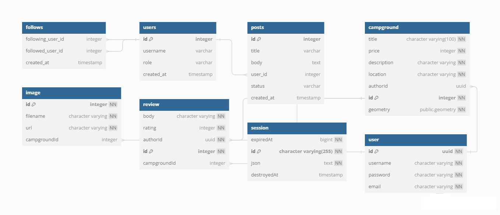

# Yelp Camp 專案

小型後端專案，可以讓使用者編輯營地資料。專案靈感來自 Udemy 講師 Colt 的課程，開發工具選擇用關聯式資料庫(PostgreSQL)、強型別語言(TypeScript)取代 MongoDB 跟 JavaScript。

[Live Demo](https://yelp-camp-deploy.onrender.com/campgrounds) :arrow_left:

## Getting Start

### Clone repository

```
git clone https://github.com/moonydog12/yelp_camp.git
cd yelp_camp
```

### 設置環境變數

```
PG_HOST = <Address of the client, e.g. http://localhost:3000/>
PG_USERNAME = <Username of the PostgreSQL, e.g. postgres>
PG_PASSWORD = <Secret used to connect to database>
PG_DATABASE = <Name of the database>
PORT = <The port the server will run on, e.g. 8080>
CLOUDINARY_CLOUD_NAME = <Client name of your cloudinary service>
CLOUDINARY_KEY = <Key name of your cloudinary service>
CLOUDINARY_SECRET = <Secret that provided by your cloudinary service>
MAPBOX_TOKEN = <Token that provided by your mapbox library service>
```

### Install packages and start server

```
npm i
npm start
```

## Features

### 後端

- 新增、讀取、更新、刪除營地資料
- 會員註冊、登入機制(採用 cookie/session 搭配 passport.js 套件)
- 會員評論功能
- 圖片上傳至第三方平台(Cloudinary)

### 前端

- mapbox 套件，將營地資訊寫入聚類地圖(需要大量資料才能完整呈現)
- mapbox 套件，在單一營地介紹的部分，透過資料庫資料標示所在位置

## Tools

<table>
  <tr>
    <td align="center" height="108" width="108">
      
      <br /><strong>TypeScript</strong>
    </td>
       <td align="center" height="108" width="108">
      
      <br /><strong>Node</strong>
    </td>
      <td align="center" height="108" width="108">
      
      <br /><strong>Express</strong>
    </td>
       <td align="center" height="108" width="108">
      
      <br /><strong>PostgreSQL</strong>
    </td>
</table>

## Notes

### Database Schema



### Cookies/Session

cookie 是當使用者瀏覽網頁時，存在瀏覽器端的片段資訊。

當 cookie 被設置後，瀏覽器會在之後的每次 request 挾帶 cookie; 使 HTTP 保有狀態(stateful)

常見的使用方式有:

- Session management
- Personalization
- Tracking

和 cookie 相反， sessions 是存在伺服器端的資訊，功用也是讓 HTTP 保有狀態

因為 cookie 有儲存大小的限制，且存放在使用者端也較不安全，採用 sessions 是更佳的選擇

簡單流程是伺服器端儲存資料後把一個 key 存在前端 cookie,這麼做可以減少前端資料儲存，並在每次 request 的時候挾帶 key 從後端取資料。

### 補充資料

[透過 Passport.js 實作驗證機制](https://reurl.cc/nN72ol)
